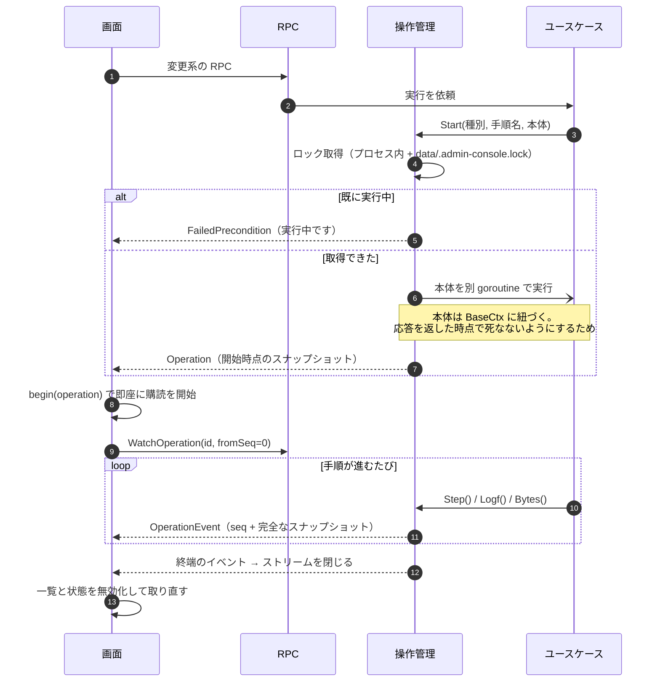

# 1. 変更系に共通する骨格

> [シーケンス一覧](README.md)　登場人物は一覧の「読み方」にある。

個別の図ではこの部分を省略する。

```mermaid
sequenceDiagram
    autonumber
    participant 画面
    participant RPC
    participant 操作管理
    participant ユースケース

    画面->>RPC: 変更系の RPC
    RPC->>ユースケース: 実行を依頼
    ユースケース->>操作管理: Start(種別, 手順名, 本体)
    操作管理->>操作管理: ロック取得（プロセス内 + data/.admin-console.lock）
    alt 既に実行中
        操作管理-->>画面: FailedPrecondition（実行中です）
    else 取得できた
        操作管理-)ユースケース: 本体を別 goroutine で実行
        Note over 操作管理,ユースケース: 本体は BaseCtx に紐づく。<br/>応答を返した時点で死なないようにするため
        操作管理-->>画面: Operation（開始時点のスナップショット）
    end

    画面->>画面: begin(operation) で即座に購読を開始
    画面->>RPC: WatchOperation(id, fromSeq=0)
    loop 手順が進むたび
        ユースケース->>操作管理: Step() / Logf() / Bytes()
        操作管理-->>画面: OperationEvent（seq + 完全なスナップショット）
    end
    操作管理-->>画面: 終端のイベント → ストリームを閉じる
    画面->>画面: 一覧と状態を無効化して取り直す
```

**押した直後から帯が出る**のは、応答に含まれる `Operation` をその場で
差し込んでいるから。`GetActiveOperation` の 5 秒ポーリングを待たない。
