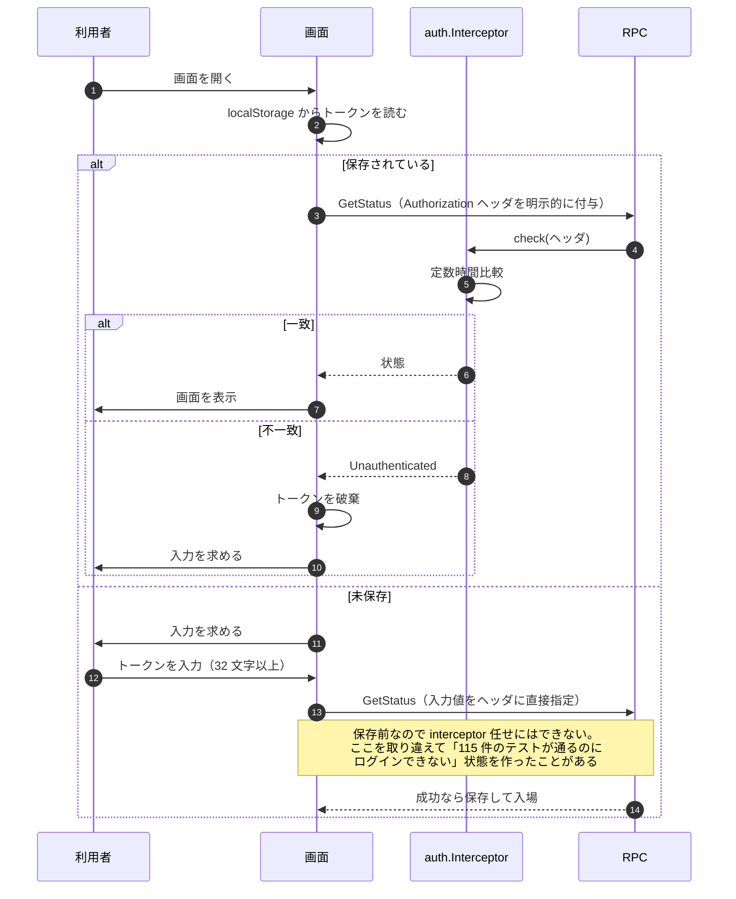

# 2. トークンによる認可

> [シーケンス一覧](README.md)　登場人物は一覧の「読み方」にある。

```mermaid
sequenceDiagram
    autonumber
    participant 利用者
    participant 画面
    participant 認証 as auth.Interceptor
    participant RPC

    利用者->>画面: 画面を開く
    画面->>画面: localStorage からトークンを読む

    alt 保存されている
        画面->>RPC: GetStatus（Authorization ヘッダを明示的に付与）
        RPC->>認証: check(ヘッダ)
        認証->>認証: 定数時間比較
        alt 一致
            認証-->>画面: 状態
            画面->>利用者: 画面を表示
        else 不一致
            認証-->>画面: Unauthenticated
            画面->>画面: トークンを破棄
            画面->>利用者: 入力を求める
        end
    else 未保存
        画面->>利用者: 入力を求める
        利用者->>画面: トークンを入力（32 文字以上）
        画面->>RPC: GetStatus（入力値をヘッダに直接指定）
        Note over 画面,RPC: 保存前なので interceptor 任せにはできない。<br/>ここを取り違えて「115 件のテストが通るのに<br/>ログインできない」状態を作ったことがある
        RPC-->>画面: 成功なら保存して入場
    end
```

ストリーム RPC も同じ interceptor を通る（`WrapStreamingHandler`）。
単項だけ実装すると `WatchOperation` が素通りする。
