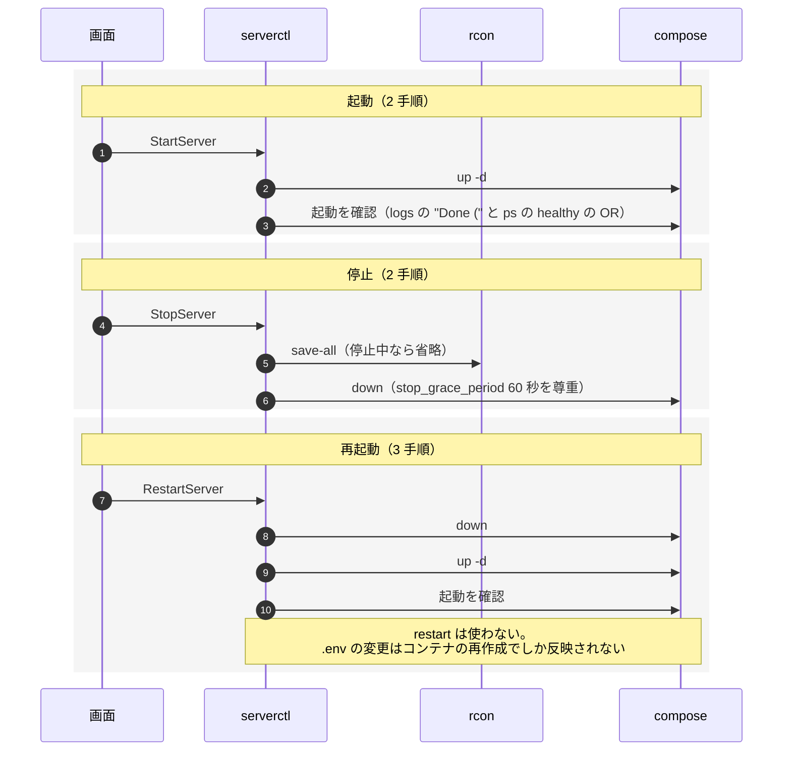

# 3. サーバーの起動・停止・再起動

> [シーケンス一覧](README.md)　登場人物は一覧の「読み方」にある。
> 変更系の共通の骨格（[1. 変更系に共通する骨格](01-common-skeleton.md)）は省略している。

```mermaid
sequenceDiagram
    autonumber
    participant 画面
    participant ユースケース as serverctl
    participant rcon
    participant compose

    rect rgb(245, 245, 245)
        Note over 画面,compose: 起動（2 手順）
        画面->>ユースケース: StartServer
        ユースケース->>compose: up -d
        ユースケース->>compose: 起動を確認（logs の "Done (" と ps の healthy の OR）
    end

    rect rgb(245, 245, 245)
        Note over 画面,compose: 停止（2 手順）
        画面->>ユースケース: StopServer
        ユースケース->>rcon: save-all（停止中なら省略）
        ユースケース->>compose: down（stop_grace_period 60 秒を尊重）
    end

    rect rgb(245, 245, 245)
        Note over 画面,compose: 再起動（3 手順）
        画面->>ユースケース: RestartServer
        ユースケース->>compose: down
        ユースケース->>compose: up -d
        ユースケース->>compose: 起動を確認
        Note over ユースケース,compose: restart は使わない。<br/>.env の変更はコンテナの再作成でしか反映されない
    end
```

人が接続しているときの停止・再起動は、画面が一度確認を挟む。
