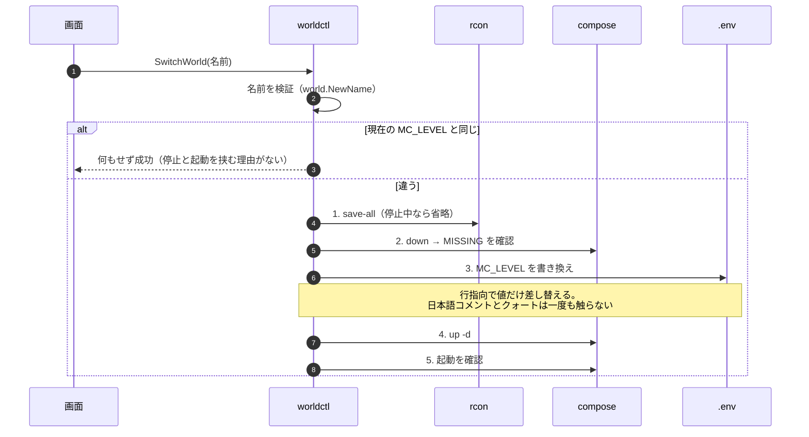

# 4. ワールドの切り替え

> [シーケンス一覧](README.md)　登場人物は一覧の「読み方」にある。
> 変更系の共通の骨格（[1. 変更系に共通する骨格](01-common-skeleton.md)）は省略している。

**停止は必須。** `LEVEL` は起動時に一度しか読まれない。
**切り替え前のワールドは 1 バイトも動かない**（`data/<名前>/` に残る）。
