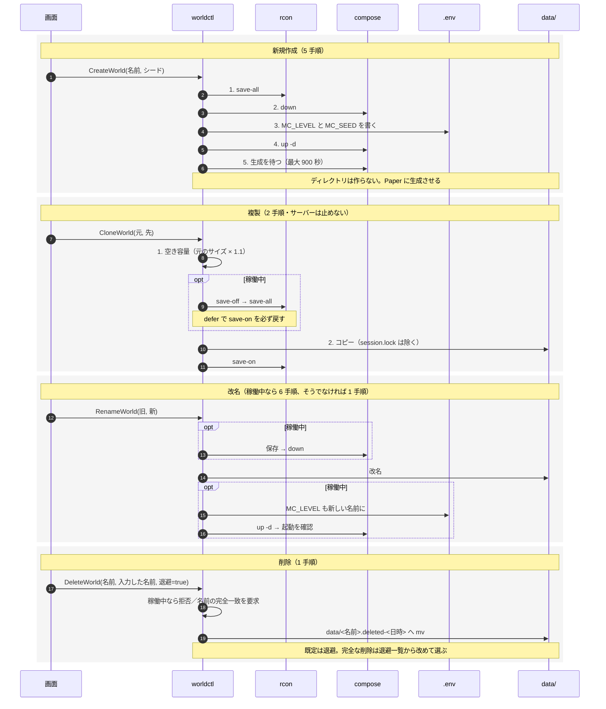

# 5. ワールドの新規作成・複製・改名・削除

> [シーケンス一覧](README.md)　登場人物は一覧の「読み方」にある。
> 変更系の共通の骨格（[1. 変更系に共通する骨格](01-common-skeleton.md)）は省略している。

```mermaid
sequenceDiagram
    autonumber
    participant 画面
    participant ユースケース as worldctl
    participant rcon
    participant compose
    participant .env
    participant data/

    rect rgb(245, 245, 245)
        Note over 画面,data/: 新規作成（5 手順）
        画面->>ユースケース: CreateWorld(名前, シード)
        ユースケース->>rcon: 1. save-all
        ユースケース->>compose: 2. down
        ユースケース->>.env: 3. MC_LEVEL と MC_SEED を書く
        ユースケース->>compose: 4. up -d
        ユースケース->>compose: 5. 生成を待つ（最大 900 秒）
        Note over ユースケース,data/: ディレクトリは作らない。Paper に生成させる
    end

    rect rgb(245, 245, 245)
        Note over 画面,data/: 複製（2 手順・サーバーは止めない）
        画面->>ユースケース: CloneWorld(元, 先)
        ユースケース->>ユースケース: 1. 空き容量（元のサイズ × 1.1）
        opt 稼働中
            ユースケース->>rcon: save-off → save-all
            Note over ユースケース,rcon: defer で save-on を必ず戻す
        end
        ユースケース->>data/: 2. コピー（session.lock は除く）
        ユースケース->>rcon: save-on
    end

    rect rgb(245, 245, 245)
        Note over 画面,data/: 改名（稼働中なら 6 手順、そうでなければ 1 手順）
        画面->>ユースケース: RenameWorld(旧, 新)
        opt 稼働中
            ユースケース->>compose: 保存 → down
        end
        ユースケース->>data/: 改名
        opt 稼働中
            ユースケース->>.env: MC_LEVEL も新しい名前に
            ユースケース->>compose: up -d → 起動を確認
        end
    end

    rect rgb(245, 245, 245)
        Note over 画面,data/: 削除（1 手順）
        画面->>ユースケース: DeleteWorld(名前, 入力した名前, 退避=true)
        ユースケース->>ユースケース: 稼働中なら拒否／名前の完全一致を要求
        ユースケース->>data/: data/<名前>.deleted-<日時> へ mv
        Note over ユースケース,data/: 既定は退避。完全な削除は退避一覧から改めて選ぶ
    end
```
