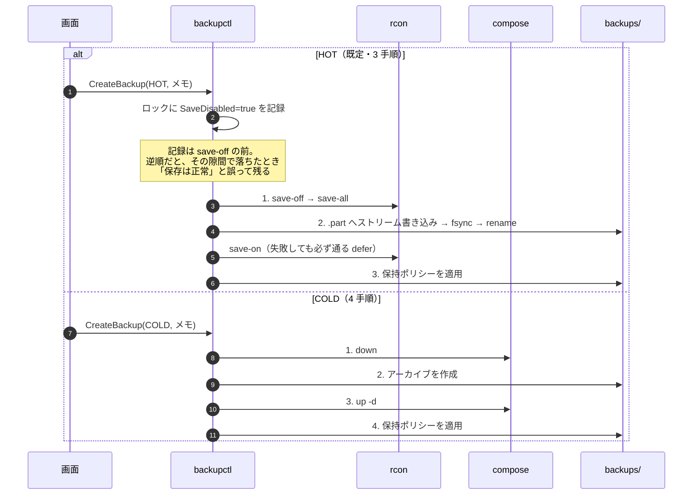

# 6. バックアップの取得

> [シーケンス一覧](README.md)　登場人物は一覧の「読み方」にある。
> 変更系の共通の骨格（[1. 変更系に共通する骨格](01-common-skeleton.md)）は省略している。

対象は `data/<MC_LEVEL>/` `data/plugins/` `data/config/` `data/bukkit.yml`
`data/spigot.yml` の 5 つ。**`server.properties` は含めない**
（`rcon.password` と `management-server-secret` を平文で持つ）。

ファイル名は `backup-<版>-<ワールド名>-<日時>[-<メモ>].zip`。
