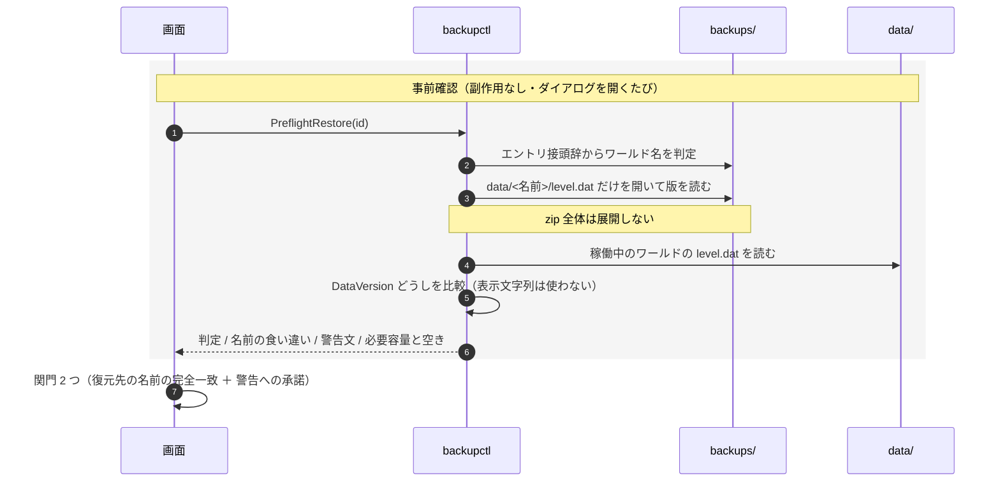
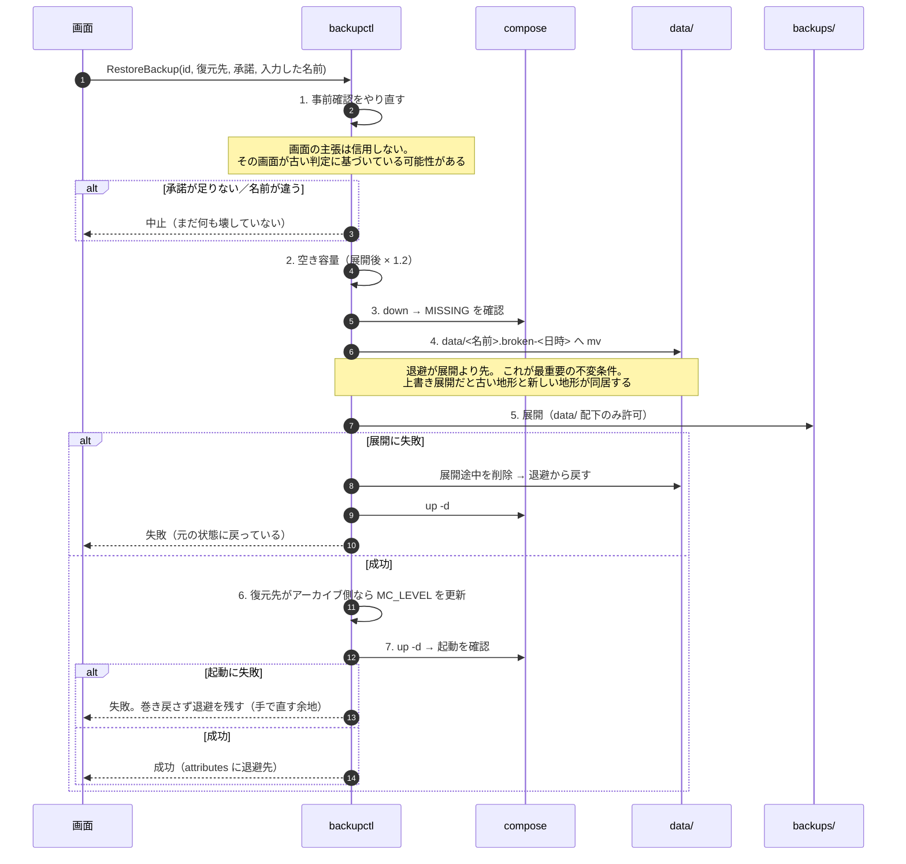

# 7. 復元

> [シーケンス一覧](README.md)　登場人物は一覧の「読み方」にある。
> 変更系の共通の骨格（[1. 変更系に共通する骨格](01-common-skeleton.md)）は省略している。

**唯一の 2 段構え。** 事前確認は副作用を持たず、何度でも呼べる。

```mermaid
sequenceDiagram
    autonumber
    participant 画面
    participant ユースケース as backupctl
    participant backups/
    participant data/

    rect rgb(245, 245, 245)
        Note over 画面,data/: 事前確認（副作用なし・ダイアログを開くたび）
        画面->>ユースケース: PreflightRestore(id)
        ユースケース->>backups/: エントリ接頭辞からワールド名を判定
        ユースケース->>backups/: data/<名前>/level.dat だけを開いて版を読む
        Note over ユースケース,backups/: zip 全体は展開しない
        ユースケース->>data/: 稼働中のワールドの level.dat を読む
        ユースケース->>ユースケース: DataVersion どうしを比較（表示文字列は使わない）
        ユースケース-->>画面: 判定 / 名前の食い違い / 警告文 / 必要容量と空き
    end

    画面->>画面: 関門 2 つ（復元先の名前の完全一致 ＋ 警告への承諾）
```

```mermaid
sequenceDiagram
    autonumber
    participant 画面
    participant ユースケース as backupctl
    participant compose
    participant data/
    participant backups/

    画面->>ユースケース: RestoreBackup(id, 復元先, 承諾, 入力した名前)

    ユースケース->>ユースケース: 1. 事前確認をやり直す
    Note over ユースケース: 画面の主張は信用しない。<br/>その画面が古い判定に基づいている可能性がある
    alt 承諾が足りない／名前が違う
        ユースケース-->>画面: 中止（まだ何も壊していない）
    end

    ユースケース->>ユースケース: 2. 空き容量（展開後 × 1.2）
    ユースケース->>compose: 3. down → MISSING を確認
    ユースケース->>data/: 4. data/<名前>.broken-<日時> へ mv
    Note over ユースケース,data/: 退避が展開より先。 これが最重要の不変条件。<br/>上書き展開だと古い地形と新しい地形が同居する
    ユースケース->>backups/: 5. 展開（data/ 配下のみ許可）

    alt 展開に失敗
        ユースケース->>data/: 展開途中を削除 → 退避から戻す
        ユースケース->>compose: up -d
        ユースケース-->>画面: 失敗（元の状態に戻っている）
    else 成功
        ユースケース->>ユースケース: 6. 復元先がアーカイブ側なら MC_LEVEL を更新
        ユースケース->>compose: 7. up -d → 起動を確認
        alt 起動に失敗
            ユースケース-->>画面: 失敗。巻き戻さず退避を残す（手で直す余地）
        else 成功
            ユースケース-->>画面: 成功（attributes に退避先）
        end
    end
```

退避は**自動で消さない**。`/worlds` の「退避したワールド」に出す。
