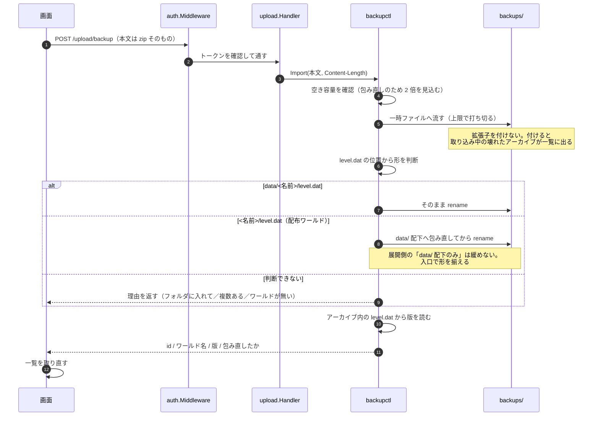

# 8. zip の取り込み

> [シーケンス一覧](README.md)　登場人物は一覧の「読み方」にある。

Connect の外側にある唯一の経路。ブラウザが平文 HTTP/2 へ昇格しないため、
client-streaming の RPC が使えない。

**取り込みは操作にしない。** `data/` を触らないので排他の枠を消費する
理由がなく、待たせると取り込み中に他の操作ができなくなる。
差し替えるかどうかは、このあと復元の関門を通して決める。
