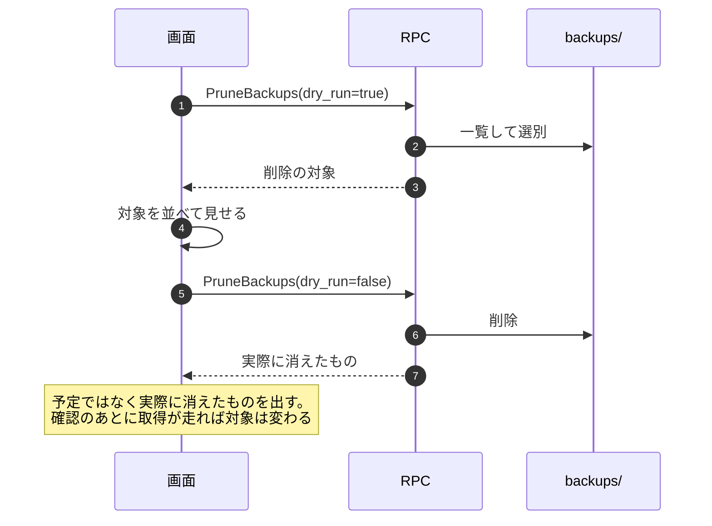

# 9. 保持ポリシーの適用

> [シーケンス一覧](README.md)　登場人物は一覧の「読み方」にある。

```mermaid
sequenceDiagram
    autonumber
    participant 画面
    participant RPC
    participant backups/

    画面->>RPC: PruneBackups(dry_run=true)
    RPC->>backups/: 一覧して選別
    RPC-->>画面: 削除の対象
    画面->>画面: 対象を並べて見せる
    画面->>RPC: PruneBackups(dry_run=false)
    RPC->>backups/: 削除
    RPC-->>画面: 実際に消えたもの
    Note over 画面: 予定ではなく実際に消えたものを出す。<br/>確認のあとに取得が走れば対象は変わる
```

世代数と日数の**両方**を満たさないものだけを削除し、
設定がどうであれ最も新しい 1 世代は必ず残す。
