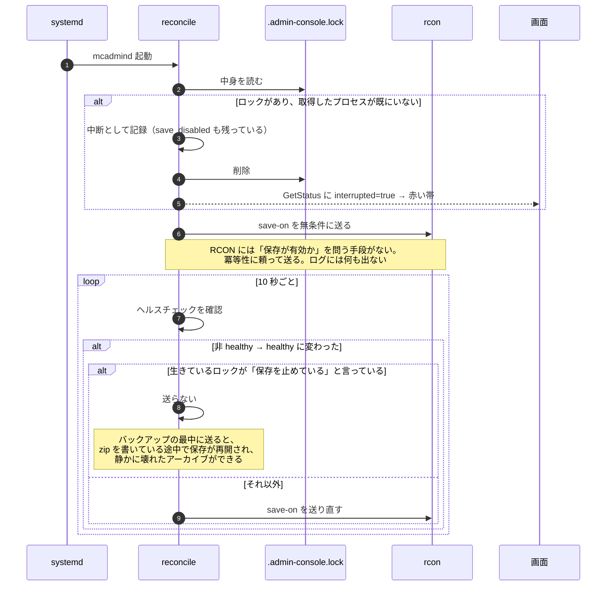

# 10. 中断の回復

> [シーケンス一覧](README.md)　登場人物は一覧の「読み方」にある。

この設計で**最も静かに壊れる**経路。`save-off` が残っても症状が出ない。

```mermaid
sequenceDiagram
    autonumber
    participant systemd
    participant 回復 as reconcile
    participant ロック as .admin-console.lock
    participant rcon
    participant 画面

    systemd->>回復: mcadmind 起動
    回復->>ロック: 中身を読む

    alt ロックがあり、取得したプロセスが既にいない
        回復->>回復: 中断として記録（save_disabled も残っている）
        回復->>ロック: 削除
        回復-->>画面: GetStatus に interrupted=true → 赤い帯
    end

    回復->>rcon: save-on を無条件に送る
    Note over 回復,rcon: RCON には「保存が有効か」を問う手段がない。<br/>冪等性に頼って送る。ログには何も出ない

    loop 10 秒ごと
        回復->>回復: ヘルスチェックを確認
        alt 非 healthy → healthy に変わった
            alt 生きているロックが「保存を止めている」と言っている
                回復->>回復: 送らない
                Note over 回復: バックアップの最中に送ると、<br/>zip を書いている途中で保存が再開され、<br/>静かに壊れたアーカイブができる
            else それ以外
                回復->>rcon: save-on を送り直す
            end
        end
    end
```
