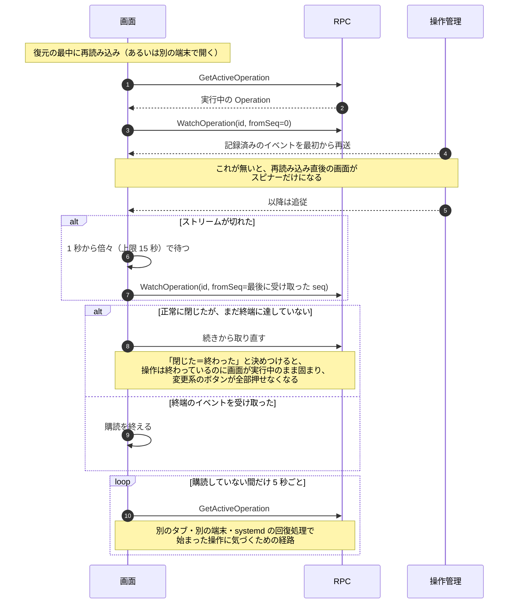

# 11. 再読み込みからの復帰

> [シーケンス一覧](README.md)　登場人物は一覧の「読み方」にある。

`WatchOperation(from_seq)` のリプレイが効いていることが前提。

```mermaid
sequenceDiagram
    autonumber
    participant 画面
    participant RPC
    participant 操作管理

    Note over 画面: 復元の最中に再読み込み（あるいは別の端末で開く）

    画面->>RPC: GetActiveOperation
    RPC-->>画面: 実行中の Operation
    画面->>RPC: WatchOperation(id, fromSeq=0)
    操作管理-->>画面: 記録済みのイベントを最初から再送
    Note over 画面,操作管理: これが無いと、再読み込み直後の画面が<br/>スピナーだけになる
    操作管理-->>画面: 以降は追従

    alt ストリームが切れた
        画面->>画面: 1 秒から倍々（上限 15 秒）で待つ
        画面->>RPC: WatchOperation(id, fromSeq=最後に受け取った seq)
    end

    alt 正常に閉じたが、まだ終端に達していない
        画面->>RPC: 続きから取り直す
        Note over 画面,RPC: 「閉じた＝終わった」と決めつけると、<br/>操作は終わっているのに画面が実行中のまま固まり、<br/>変更系のボタンが全部押せなくなる
    else 終端のイベントを受け取った
        画面->>画面: 購読を終える
    end

    loop 購読していない間だけ 5 秒ごと
        画面->>RPC: GetActiveOperation
        Note over 画面,RPC: 別のタブ・別の端末・systemd の回復処理で<br/>始まった操作に気づくための経路
    end
```
