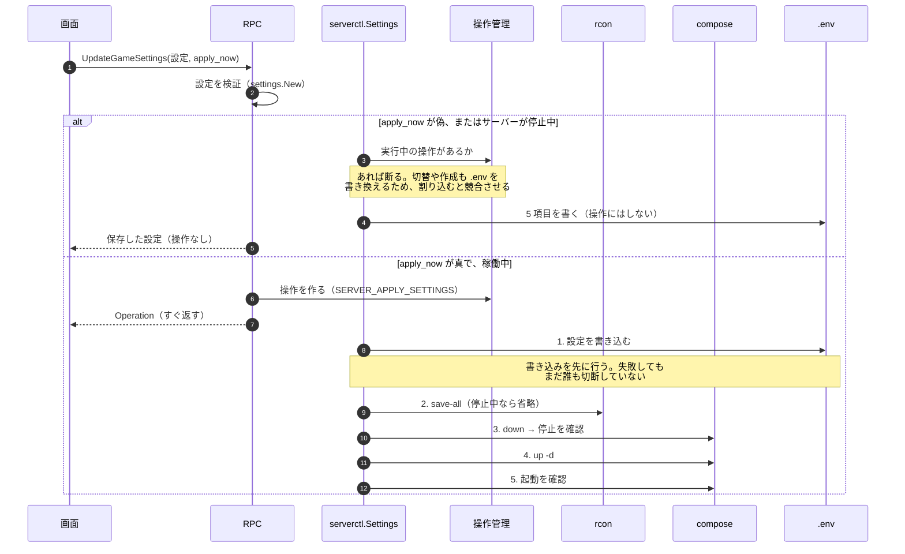

# 12. ゲーム設定の保存と反映

> [シーケンス一覧](README.md)　登場人物は一覧の「読み方」にある。
> 変更系の共通の骨格（[1. 変更系に共通する骨格](01-common-skeleton.md)）は省略している。

**反映は作り直しでしか効かない。** `OVERRIDE_SERVER_PROPERTIES=TRUE` により、
起動のたびに `.env` から `server.properties` が作り直される。
**止まっているサーバーは起動しない。** 保存した設定は次の起動で反映される。
**変えられるのは 5 項目だけ。** バージョン・種別・メモリ・ワールド名は画面から変えない（REQ-420）。
