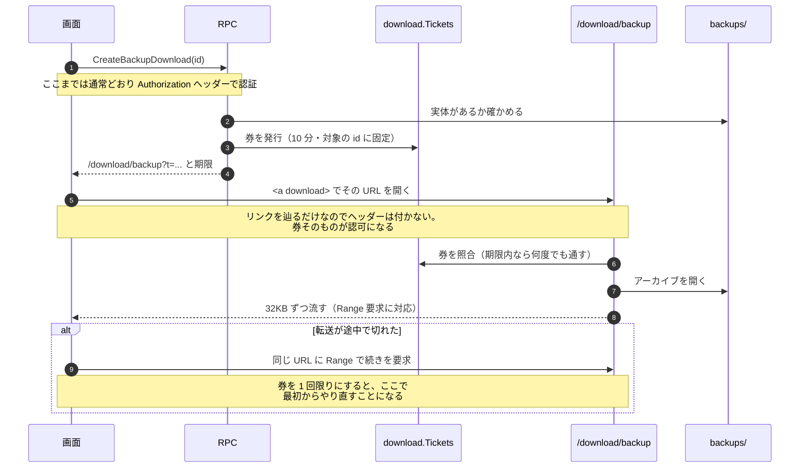

# 13. バックアップの持ち出し（ダウンロード）

> [シーケンス一覧](README.md)　登場人物は一覧の「読み方」にある。

```mermaid
sequenceDiagram
    autonumber
    participant 画面
    participant RPC
    participant 受取券 as download.Tickets
    participant 受取口 as /download/backup
    participant backups/

    画面->>RPC: CreateBackupDownload(id)
    Note over 画面,RPC: ここまでは通常どおり Authorization ヘッダーで認証
    RPC->>backups/: 実体があるか確かめる
    RPC->>受取券: 券を発行（10 分・対象の id に固定）
    RPC-->>画面: /download/backup?t=... と期限

    画面->>受取口: <a download> でその URL を開く
    Note over 画面,受取口: リンクを辿るだけなのでヘッダーは付かない。<br/>券そのものが認可になる
    受取口->>受取券: 券を照合（期限内なら何度でも通す）
    受取口->>backups/: アーカイブを開く
    受取口-->>画面: 32KB ずつ流す（Range 要求に対応）

    alt 転送が途中で切れた
        画面->>受取口: 同じ URL に Range で続きを要求
        Note over 画面,受取口: 券を 1 回限りにすると、ここで<br/>最初からやり直すことになる
    end
```

**`ADMIN_TOKEN` は URL に載せない。** 長期の鍵が履歴や画面共有に残る（REQ-423）。
**メモリに載せない。** 200MB のアーカイブをそのまま流す（REQ-424）。
