# ユースケース別シーケンス

**作成日**: 2026-09-11
**対象**: 管理コンソール（`mcadmind`）
**関連**: [requirements.md](requirements.md) / [architecture.md](architecture.md) / [note.md](note.md)

画面の操作が、どの層を通って `data/` や `.env` に届くかを追う。
手順名は実装（`*Steps`）そのままなので、画面の帯に出る文字列と一致する。

---

## 0. 読み方

| 登場人物 | 実体 |
|---|---|
| **画面** | ブラウザ上の React。`features/*` のフック |
| **RPC** | `presentation/rpc` の Connect ハンドラ |
| **操作管理** | `application/operations.Manager`。排他とイベント列を持つ |
| **ユースケース** | `application/usecase/*`。手順の順序を持つ |
| **compose** | `docker compose`（`infrastructure/container/compose`） |
| **rcon** | `docker compose exec -T mc rcon-cli` |
| **.env** | `infrastructure/config/dotenv` |
| **data/** | ワールドの実体（`infrastructure/filesystem/worldfs`） |
| **backups/** | アーカイブの保管先（`infrastructure/persistence/backupfs`） |

**変更系はすべて同じ骨格を持つ。** RPC は操作を 1 つ作って**すぐ返し**、
本体は別の goroutine で走る。画面は返ってきた操作を購読して進捗を見る。

---

## 1. 変更系に共通する骨格

個別の図ではこの部分を省略する。

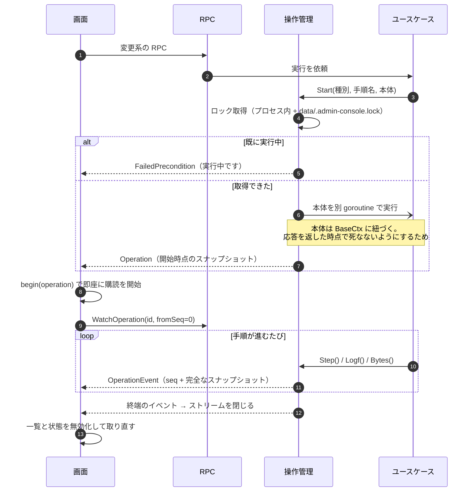

**押した直後から帯が出る**のは、応答に含まれる `Operation` をその場で
差し込んでいるから。`GetActiveOperation` の 5 秒ポーリングを待たない。

---

## 2. トークンによる認可

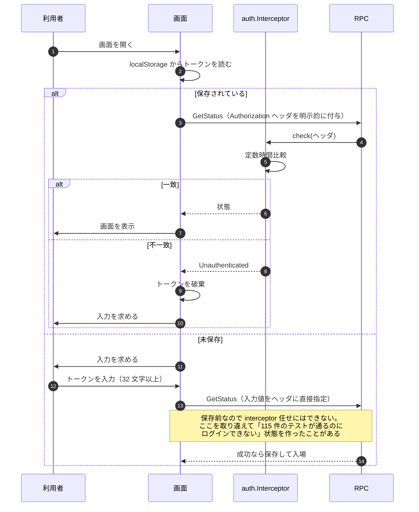

ストリーム RPC も同じ interceptor を通る（`WrapStreamingHandler`）。
単項だけ実装すると `WatchOperation` が素通りする。

---

## 3. サーバーの起動・停止・再起動

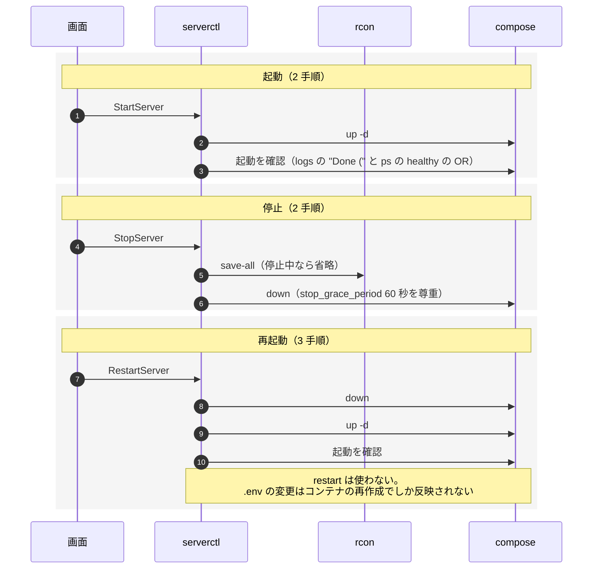

人が接続しているときの停止・再起動は、画面が一度確認を挟む。

---

## 4. ワールドの切り替え

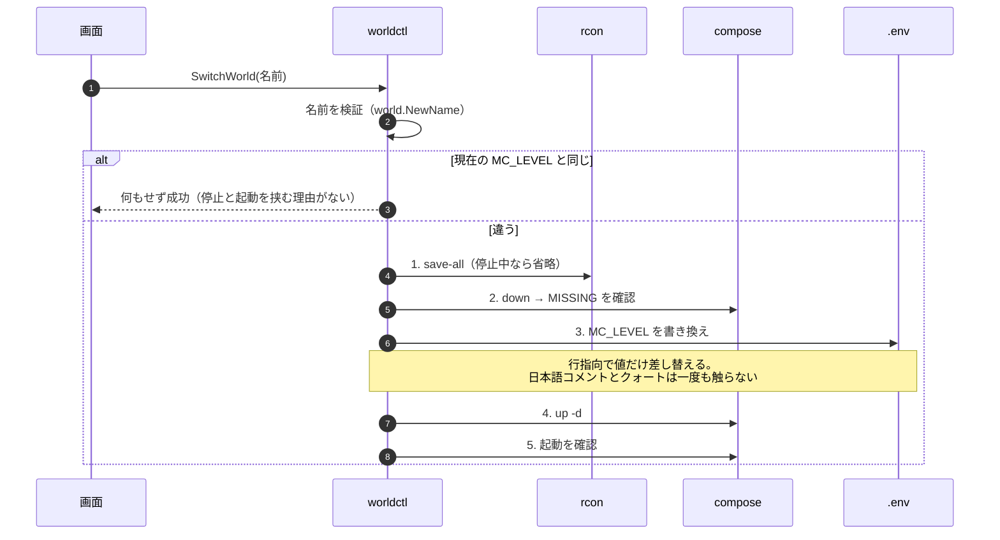

**停止は必須。** `LEVEL` は起動時に一度しか読まれない。
**切り替え前のワールドは 1 バイトも動かない**（`data/<名前>/` に残る）。

---

## 5. ワールドの新規作成・複製・改名・削除

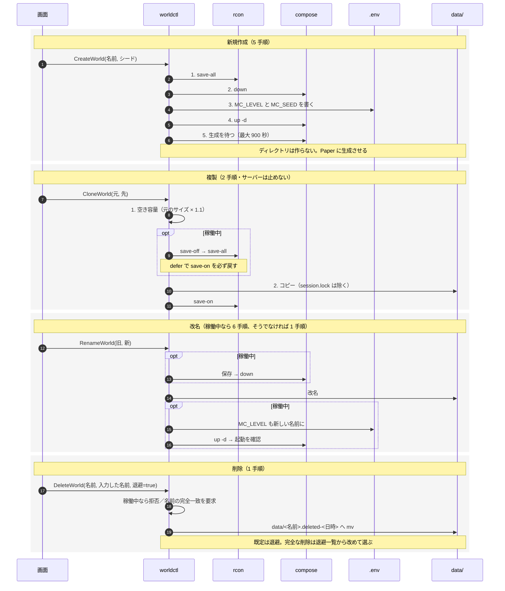

---

## 6. バックアップの取得

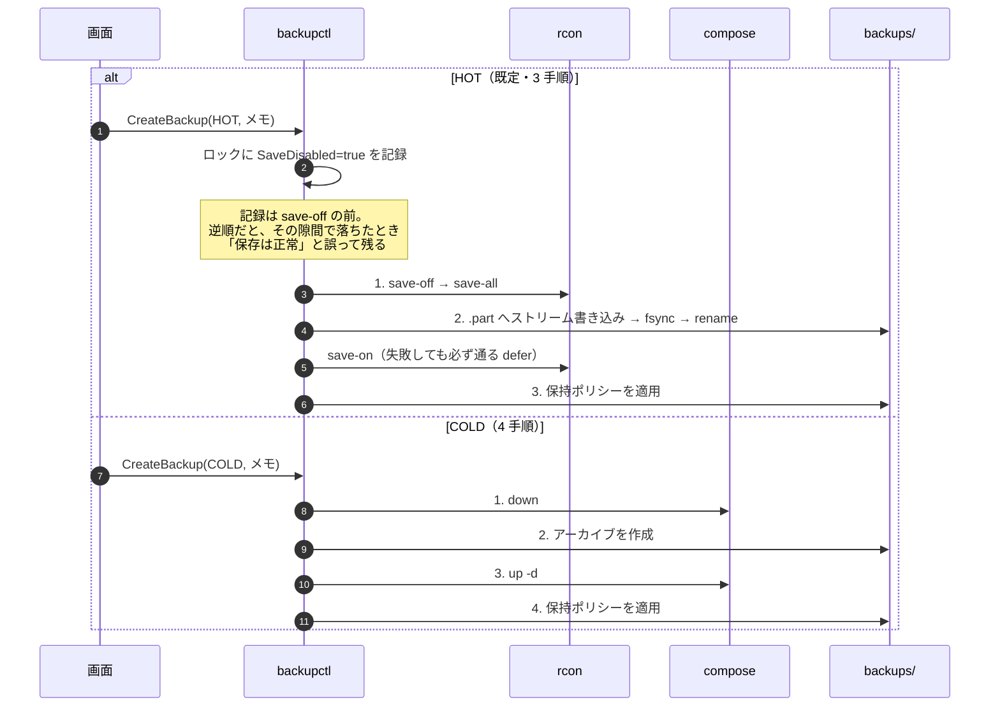

対象は `data/<MC_LEVEL>/` `data/plugins/` `data/config/` `data/bukkit.yml`
`data/spigot.yml` の 5 つ。**`server.properties` は含めない**
（`rcon.password` と `management-server-secret` を平文で持つ）。

ファイル名は `backup-<版>-<ワールド名>-<日時>[-<メモ>].zip`。

---

## 7. 復元

**唯一の 2 段構え。** 事前確認は副作用を持たず、何度でも呼べる。

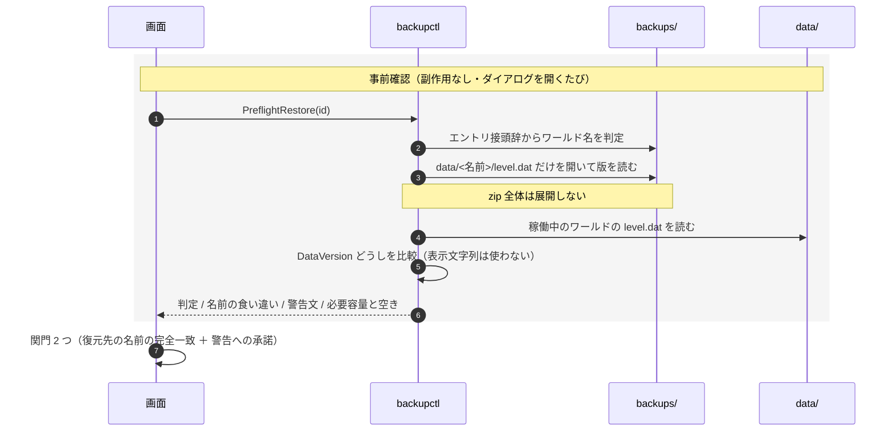

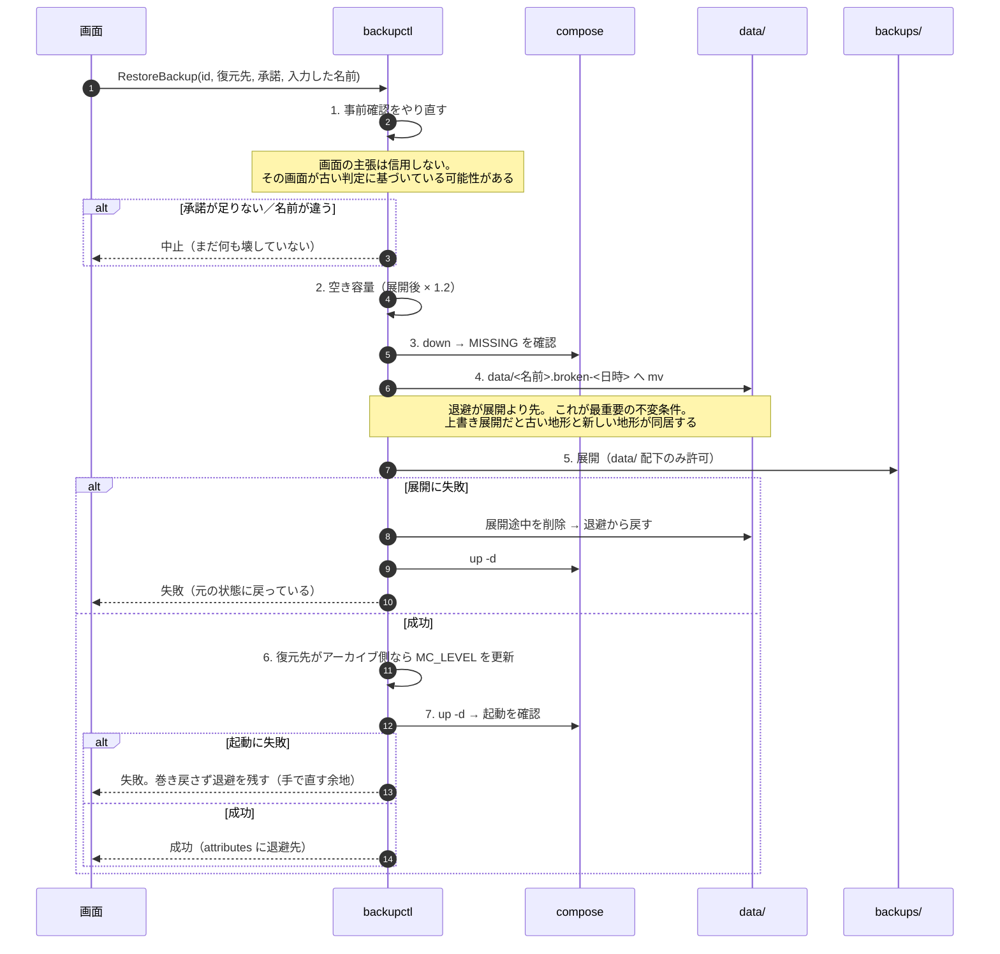

退避は**自動で消さない**。`/worlds` の「退避したワールド」に出す。

---

## 8. zip の取り込み

Connect の外側にある唯一の経路。ブラウザが平文 HTTP/2 へ昇格しないため、
client-streaming の RPC が使えない。

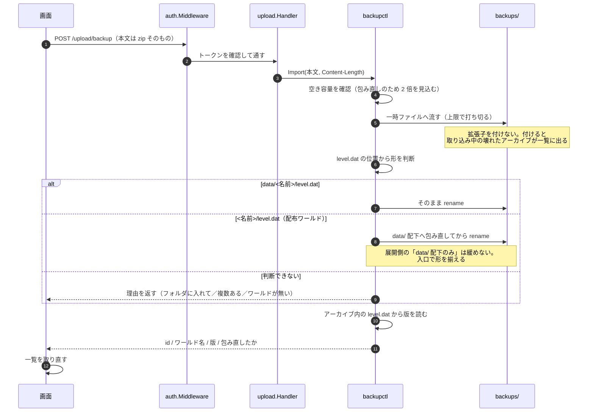

**取り込みは操作にしない。** `data/` を触らないので排他の枠を消費する
理由がなく、待たせると取り込み中に他の操作ができなくなる。
差し替えるかどうかは、このあと復元の関門を通して決める。

---

## 9. 保持ポリシーの適用

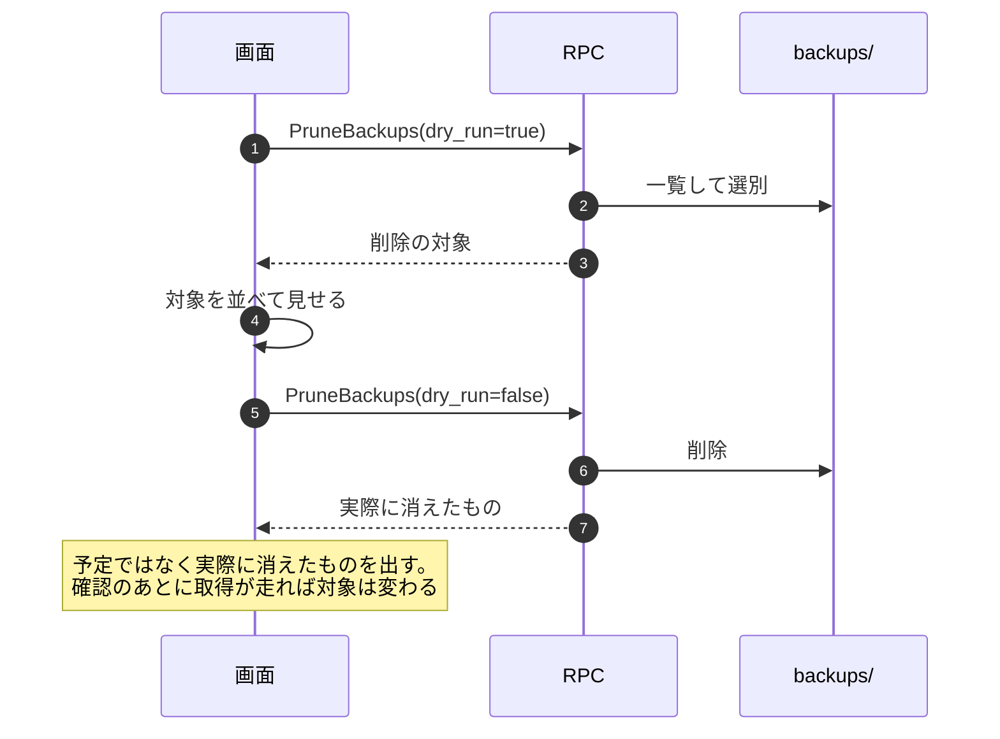

世代数と日数の**両方**を満たさないものだけを削除し、
設定がどうであれ最も新しい 1 世代は必ず残す。

---

## 10. 中断の回復

この設計で**最も静かに壊れる**経路。`save-off` が残っても症状が出ない。

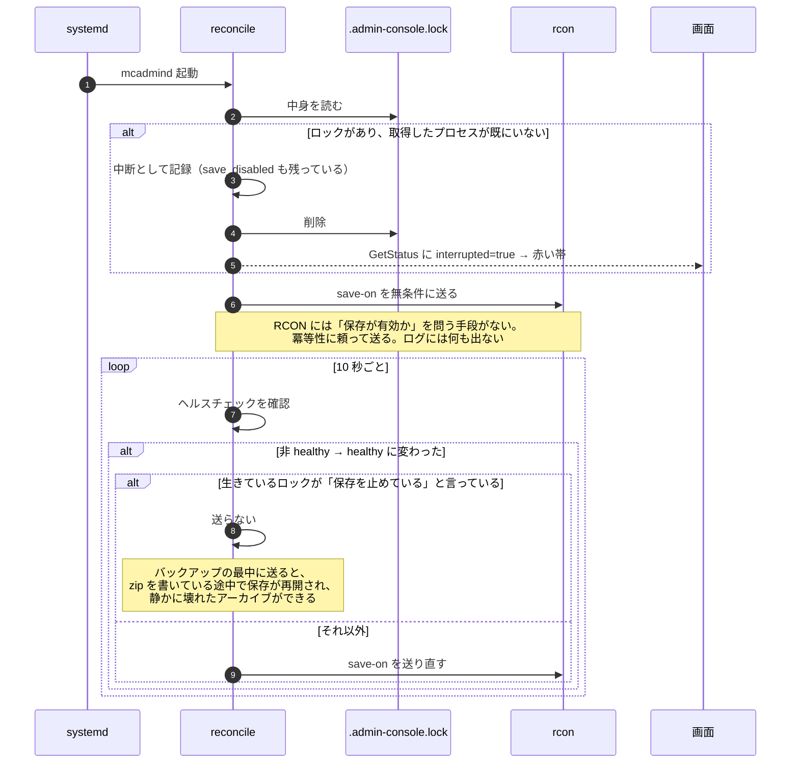

---

## 11. 再読み込みからの復帰

`WatchOperation(from_seq)` のリプレイが効いていることが前提。

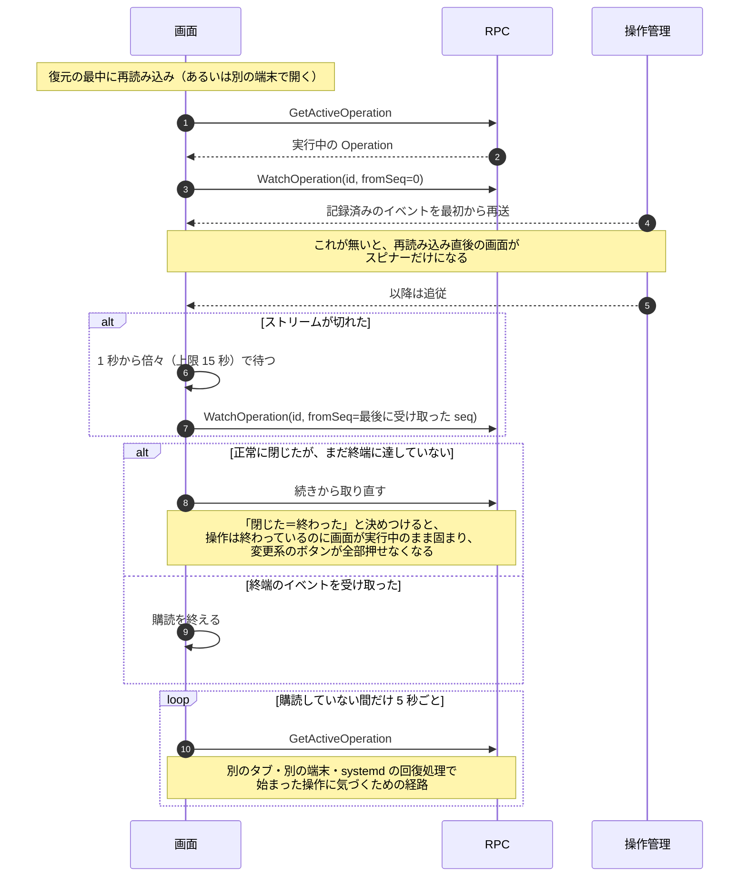
